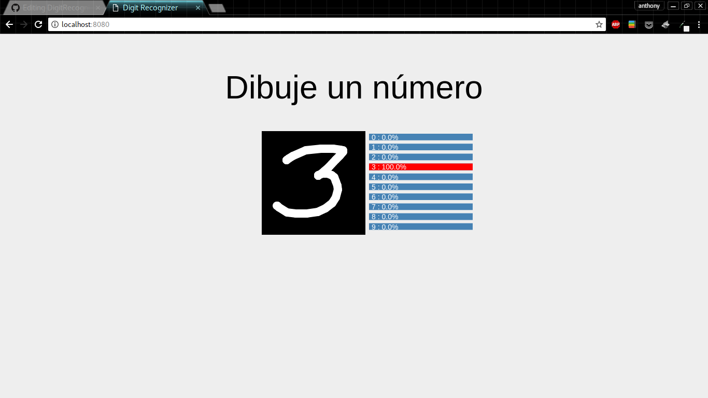

# DigitRecognizer

Aplicación web para reconocer números dibujados en un canvas. Desarrollada usando [Flask](http://flask.pocoo.org/) y [p5.js](https://p5js.org/) 
en la parte web. [Keras](https://keras.io/) con [TensorFlow](https://www.tensorflow.org/) como BackEnd para el modelo de red neuronal.

### Instalación de dependencias
```
$pip install -r requirements.txt
```
### Ejecución
```
$python server.py
```

<p align="center"><p>

